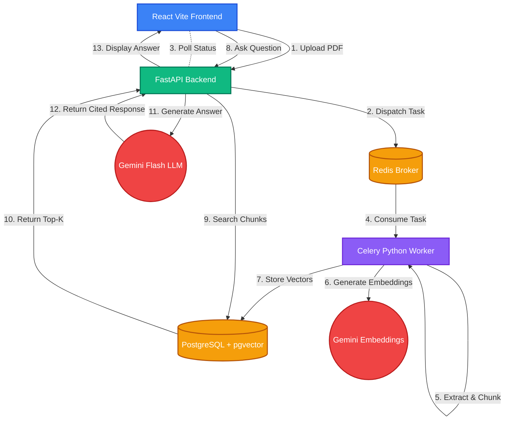
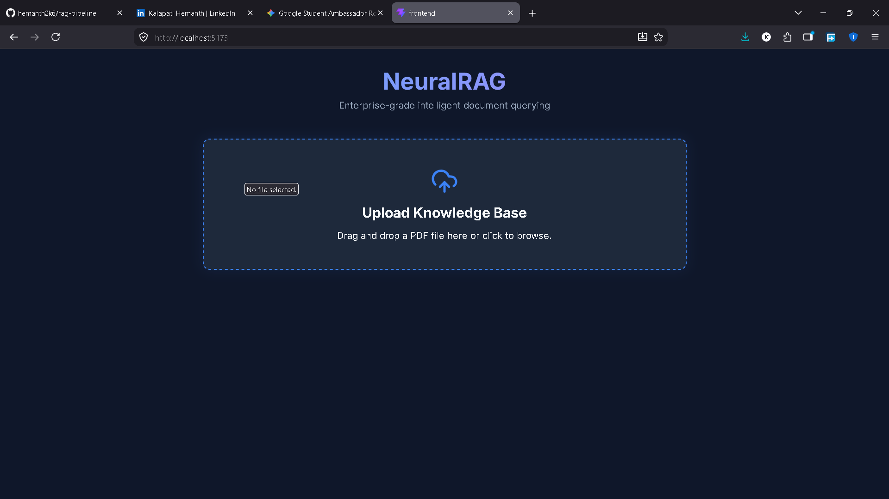
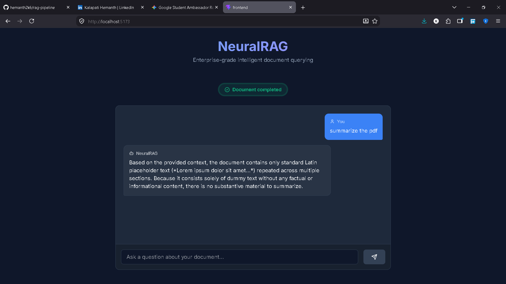

# NeuralRAG: Enterprise Document Intelligence 🧠

NeuralRAG is an enterprise-grade Retrieval-Augmented Generation (RAG) pipeline built for FAANG-level scale. It allows users to upload PDF documents, asynchronously processes them into vector embeddings, and provides a conversational interface to query the documents with high-accuracy, cited responses.

## 🚀 Features

- **Asynchronous Document Processing:** Heavy lifting (chunking, embedding) is offloaded to a background Celery worker using Redis, keeping the main API blazingly fast.
- **Advanced Vector Search:** Utilizes PostgreSQL with `pgvector` extension for efficient and exact k-NN cosine similarity search across 3072-dimensional vector spaces.
- **State-of-the-Art Models:** Powered by Google's Gemini family: `gemini-3.8-flash` for high-speed generation and `gemini-embedding-2` for rich, deep embeddings.
- **Strict Grounding & Citations:** The prompt engineering enforces strict grounding. The LLM will only answer based on the provided context and will explicitly refuse to hallucinate.
- **Modern React Frontend:** A beautiful, responsive, and intuitive chat UI built with Vite, React, and Lucide Icons.

## 🏗️ Architecture



## 🛠️ Technology Stack

- **Frontend:** React 18, TypeScript, Vite, Axios, Lucide-React
- **Backend:** FastAPI, Uvicorn, Python 3.12
- **Worker & Queue:** Celery, Redis
- **Database:** PostgreSQL 16, pgvector, SQLAlchemy, asyncpg
- **AI & RAG:** LangChain, Google Generative AI (Gemini)

## ⚙️ Local Setup

### Prerequisites
- Git
- Docker and Docker Compose
- Node.js (v18+) and npm
- A Google Gemini API Key

### 1. Clone the Repository
Start by cloning the repository to your local machine:
```bash
git clone https://github.com/hemanth2k6/rag-pipeline.git
cd rag-pipeline
```

### 2. Environment Configuration
Create a `.env` file in the root directory:
```env
GOOGLE_API_KEY=your_gemini_api_key_here
```

### 3. Start the Backend Stack
Run the following command to start PostgreSQL, Redis, FastAPI, and the Celery worker:
```bash
docker compose up -d --build
```
*Note: The first run will automatically run database migrations and create the schema.*

### 4. Start the Frontend
In a new terminal, navigate to the frontend directory and start the dev server:
```bash
cd frontend
npm install
npm run dev
```

The application will be accessible at `http://localhost:5173`.

## 🔌 API Endpoints

- `POST /upload`: Accepts a multipart/form-data file and dispatches a Celery task. Returns a tracking `document_id`.
- `GET /document/{document_id}`: Polls the processing status of a document (`pending`, `completed`, `failed`).
- `POST /ask`: Accepts a JSON payload `{"question": "..."}` and returns the LLM-generated answer alongside source citations.

## 📸 Screenshots

### Upload Page


### Chat Interface

